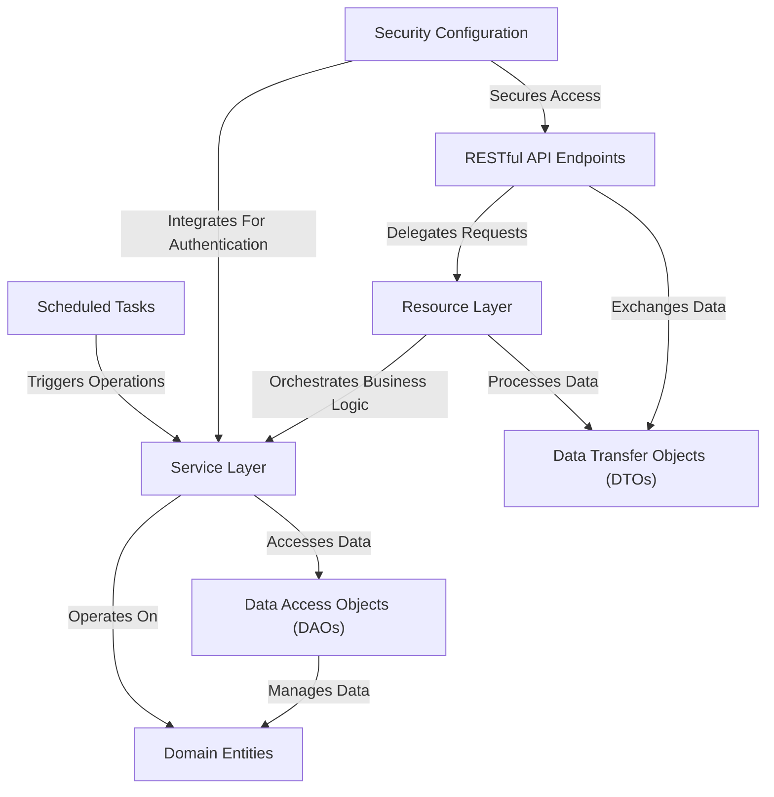
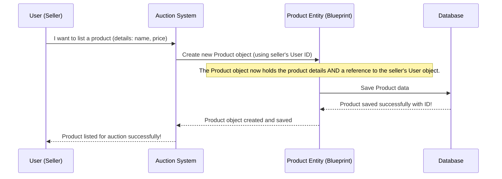
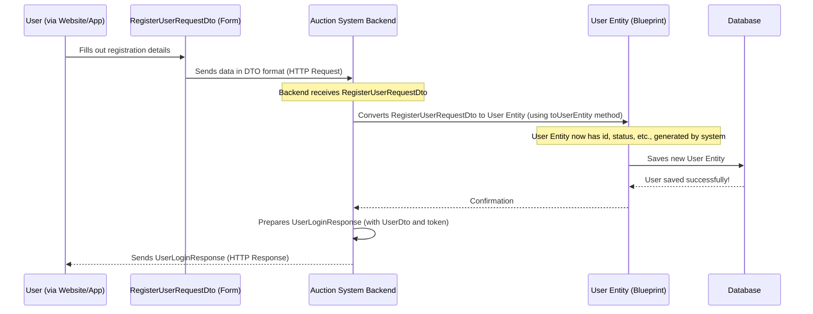
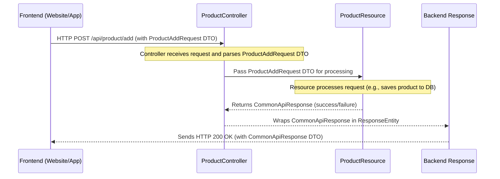
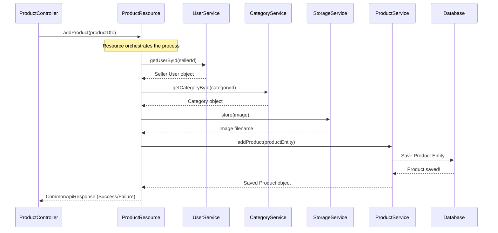
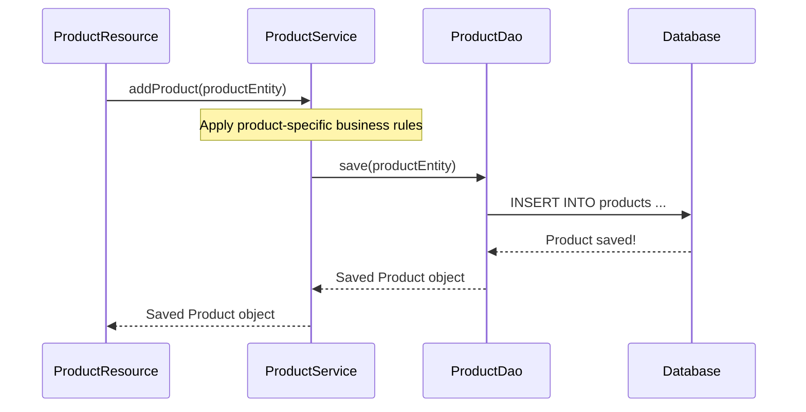
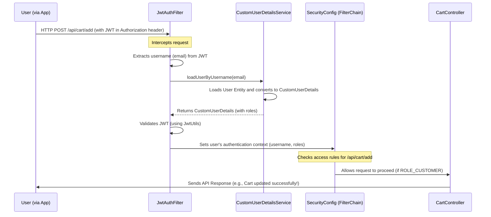
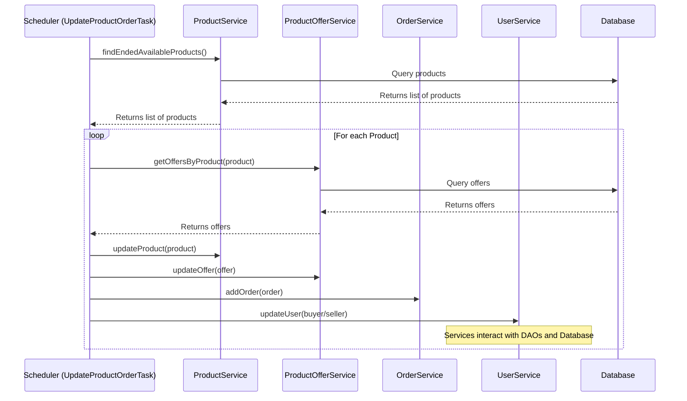

# Auction System Backend

This project, `auctionSystemBackend`, is a robust **backend system** for an *online auction platform*. It provides a structured way to handle all aspects of an auction, from managing product listings and bids to user authentication and order processing. The system also includes automated tasks to ensure *auction lifecycles* are smoothly managed, such as identifying winning bids and processing orders once an auction ends.

## Visual Overview

 
 
 

### Here's a simplified flow of how this might work behind the scenes:

 
 
 

### Let's trace how DTOs are used when a user registers:

In this flow:
1.  The `User (via Website/App)` provides their registration information.
2.  This information is packaged into a `RegisterUserRequestDto` and sent to our `Auction System Backend`.
3.  The `Auction System Backend` receives this DTO. It then uses the `toUserEntity` method within `RegisterUserRequestDto` (or a similar conversion process) to transform the DTO's data into a `User` [Domain Entity](). This is where internal fields like `id` are added.
4.  The `User Entity` is then saved to the `Database`.
5.  After successful saving, the `Auction System Backend` constructs a `UserLoginResponse` DTO. This response contains a `UserDto` (a *simplified* version of the `User` entity for the frontend) and a `jwtToken`.
6.  Finally, this `UserLoginResponse` DTO is sent back to the `User (via Website/App)`, completing the registration process.

 
 
 

### Here's a simplified step-by-step look at what happens when the frontend calls an endpoint:

In this flow:
1.  The `Frontend` (your web browser or mobile app) sends a `POST` request to the backend's `/api/product/add` endpoint, including the `ProductAddRequest` DTO as the data.
2.  The `ProductController` (our "receptionist") catches this request because its `@RequestMapping` and `@PostMapping` annotations match the incoming URL and HTTP method. It automatically turns the raw data into a `ProductAddRequest` Java object.
3.  The `ProductController` then hands over the `ProductAddRequest` to the `ProductResource` (the "doer" of the work).
4.  The `ProductResource` does the actual "business logic" (like creating the product in the database).
5.  After processing, the `ProductResource` returns a `CommonApiResponse` (which tells us if the operation was successful and includes a message).
6.  The `ProductController` receives this response, wraps it in a `ResponseEntity` (which includes the HTTP status like "200 OK"), and sends it back to the `Frontend`.

 
 
 

### How the Resource Layer Orchestrates

Here's a simplified flow for adding a product:

As you can see, the `ProductResource` coordinates calls to `UserService`, `CategoryService`, `StorageService`, and `ProductService` to achieve the `addProduct` operation. It doesn't do the user lookup, category lookup, image storage, or actual product saving itself, but it *tells* the right "department" (service) to do its part.

 
 
 

### Use Case Example: Adding a Product

Let's trace our "Add a Product" use case again.

`ProductResource` calls `this.productService.addProduct(product);`. This `productService` is where the core logic for adding a product resides.

In this simplified flow:
1.  The `ProductResource` (our project manager) hands the complete `Product` [Domain Entity]() to the `ProductService`.
2.  The `ProductService` (our product expert) takes the `Product` entity. This is where it would apply any specific rules before saving (e.g., checking if the price is valid, setting default status).
3.  The `ProductService` then asks `ProductDao` (our librarian) to `save()` the `Product` entity.
4.  The `ProductDao` communicates directly with the `Database` to store the information.
5.  The saved `Product` entity flows back from the `Database` through `ProductDao` to `ProductService`, and finally back to `ProductResource`.

 
 
 

### How Security Works Behind the Scenes (Protected API Call)

**Explanation of the Flow:**
1.  **User (via App) sends request:** The user's application sends a `POST` request to `/api/cart/add`, including the JWT they received during login in the `Authorization` header.
2.  **`JwtAuthFilter` intercepts:** This filter is configured to run before any other processing. It catches the incoming request.
3.  **Extracts & Validates Token:** It pulls the JWT from the header, extracts the username (email) from it, and asks `CustomUserDetailsService` to load the full user details, then verifies the token's authenticity and expiration using `JwtUtils`.
4.  **Sets Authentication Context:** If the token is valid, `JwtAuthFilter` tells Spring Security, "This request is from *this* user, and they have *these* roles (e.g., `ROLE_CUSTOMER`). Now, you can process the request."
5.  **`SecurityConfig` (FilterChain) Authorizes:** The `SecurityFilterChain` defined in `SecurityConfig` then looks at its rules. It sees that `/api/cart/add` requires `ROLE_CUSTOMER`. Since the `JwtAuthFilter` just confirmed the user has `ROLE_CUSTOMER`, the request is authorized.
6.  **Request proceeds:** The request is finally allowed to reach the `CartController` (our [Controller Layer]()), which then processes the "add to cart" logic.
7.  **Response:** The `CartController` (or its underlying layers) performs the action and sends back an API response.

 
 
 

### How it Works Behind the Scenes (Simplified Flow)

Let's look at a simplified flow of how the `UpdateProductOrderTask` coordinates with our other layers:

In this flow:
1.  The `Scheduler (UpdateProductOrderTask)` wakes up at its `fixedRate` (every minute).
2.  It first asks the `ProductService` to find all products whose bidding period has ended and are still `AVAILABLE`.
3.  For each such product, it then asks `ProductOfferService` to get all bids.
4.  After determining the winner and updating product/offer statuses, it asks `OrderService` to create a new order.
5.  Finally, it asks `UserService` to update the wallets of both the buyer and the seller.
6.  Each `Service` (Product, ProductOffer, Order, User) then uses its corresponding [DAO]() to interact with the `Database` to perform the actual saving or updating of records.

